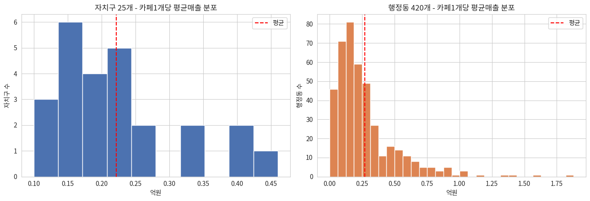
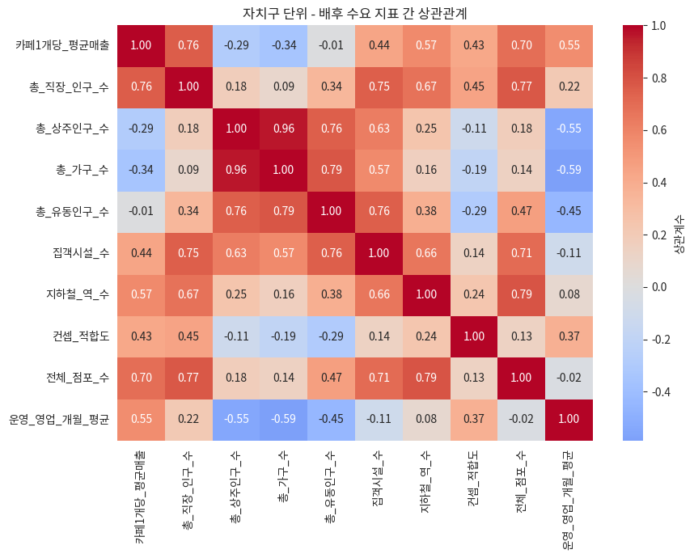
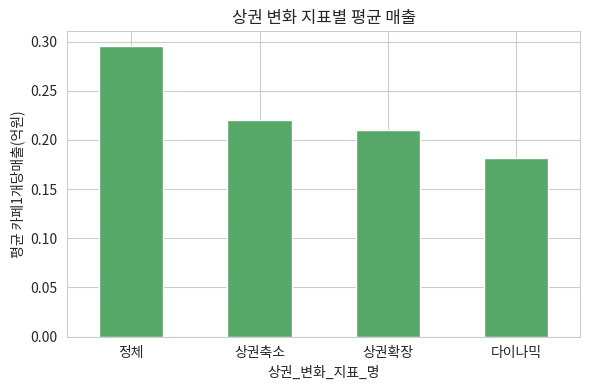

# 서울시 카페 입지 EDA 리포트

**작성자:** 김석호 | **프로젝트:** 엘리스 ABA 1차 프로젝트 (서울 버전) | **기준 데이터:** 서울시 상권분석서비스(자치구 단위 2026년 1분기, 행정동 단위 2025년 4분기까지)

---

## 1. 문제 정의

**내가 서울에 카페를 개업하려 한다면, 어느 상권이 카페를 개업하기에 가장 적절할까?**

서울시 상권분석서비스는 카페 업종의 실제 추정매출을 이미 제공하기 때문에, 매출을 대리 지표로 추정할 필요 없이 곧바로 "왜 어떤 지역은 카페 매출이 높은가"를 **설명하는 문제**로 접근한다. 이 EDA 리포트는 회귀모델을 만들기 전에 데이터를 제대로 이해하는 단계이며, 모델링 결과와 최종 후보 선정은 각각 `모델링결과보고서_서울.md`, `최종_인사이트_리포트_서울.md`에서 다룬다.

분석 단위는 두 층이다 — **자치구 단위(25개)**는 서울 전체 그림과 회귀모델에, **행정동 단위(420개)**는 실제 입지 후보를 좁힐 때 사용한다.

## 2. 데이터 소스와 전처리

- **서울시 우리마을가게 상권분석서비스**(서울 열린데이터광장) — 추정매출·점포·직장인구·상주인구·유동인구·집객시설·상권변화지표 등을 자치구/행정동 단위로 제공. 서비스_업종_코드 "CS100010"(커피-음료)을 카페 업종의 대리 지표로 사용했다.
- 자치구 단위는 2021년 1분기~2026년 1분기(21개 분기) 시계열을 제공하지만, 행정동 단위는 2025년 4분기까지만 공개되어 **두 레벨의 분석 시점이 약 1개 분기 어긋나 있다.** 큰 흐름을 바꿀 정도는 아니지만 한계로 명시한다.
- 자치구 단위 점포 파일의 점포수 컬럼명은 "전체_점포_수", 행정동 단위는 "점포_수"로 같은 개념인데 이름이 다르다는 점을 확인하고 병합했다.
- 파생 변수: **카페1개당_평균매출** = 당월_매출_금액 ÷ 점포수, **컨셉_적합도** = 아침(06~11시)+점심(11~14시)+저녁(17~21시) 매출 비중의 합, **성장률** = (2025년 4분기 매출 − 1분기 매출) ÷ 1분기 매출 × 100.

## 3. 데이터 규모와 결측치

| 테이블 | 크기 | 결측치 |
|---|---|---|
| 자치구 종합표 | 25행 × 22열 | 0건 |
| 행정동 후보표 | 420행 × 15열 | 0건 |

결측치가 없다는 것이 "데이터가 완벽하다"는 뜻은 아니다. 지금까지의 병합 과정이 inner join(양쪽에 다 있는 것만 남기는 방식)을 써서, 안 맞는 행이 조용히 빠졌을 수 있기 때문이다. 실제로 자치구는 25개 전부, 행정동표에도 25개 자치구가 빠짐없이 등장하며 행정동 개수(420개)도 서울시 공식 행정동 수(자료 시점에 따라 420~426개)와 큰 차이가 없어, 병합 과정에서 크게 유실된 것은 아니라고 판단했다. 숫자여야 할 컬럼은 모두 int64/float64로, 이름·코드류만 문자열(object)로 잘 들어와 있어 자료형 문제도 없다.

## 4. 이상치 점검

**반올림 때문에 0으로 보이는 값**: 서빙고동·돈암1동·응암2동·삼성동 4곳은 `카페1개당_평균매출_억원`이 0.00으로 찍히지만, 실제 매출이 0원인 게 아니라 억원 단위로 반올림하면 0에 가까울 만큼 작기 때문이다(예: 서빙고동은 점포 23개, 매출 합계 약 1,028만원 → 1개당 약 45만원). 이 값들은 그대로 두되 원 단위 컬럼도 함께 참고했다.

**표본이 작은 행정동**: 점포 수가 5개 미만인 행정동이 5곳 있다(2~4개). 매출 평균 하나가 튀는 값 하나에 크게 흔들릴 수 있어, 최종 후보 선정 단계에서는 이보다 더 엄격한 기준(점포 20개 이상)으로 안정 표본을 걸렀다.

**컨셉_적합도가 100이 안 되는 이유**: 컨셉_적합도(=아침+점심+저녁 매출 비중의 합)는 자치구 기준 63.0~78.3, 행정동 기준 11.4~86.6 사이에 분포한다. 하루 매출 시간대가 원래 6개 구간으로 나뉘어 있는데 컨셉_적합도는 그중 3개 구간만 더한 값이기 때문이며, 계산 오류가 아니라 "낮 시간대 세 끼 시간대에 얼마나 몰려 있는가"만 보려고 의도적으로 3개만 골라 더한 것이다.

## 5. 대상 변수(카페1개당 평균매출)의 분포

자치구 단위는 25개뿐이라 종모양이라 부르기엔 표본이 작지만, 0.1~0.46억원 사이에 완만하게 퍼져 있고 극단적인 이상치는 없다. 행정동 단위(420개)는 오른쪽으로 꼬리가 긴 분포다 — 대부분 0~0.4억원대에 몰려 있고, 일부 상위 행정동(소공동 등)이 1억원을 훌쩍 넘기며 평균을 끌어올린다. 이 오른쪽 꼬리가 바로 우리가 찾는 "카페 매출이 특별히 높은 입지 후보"들이다.

## 6. 변수 간 상관관계 (자치구 단위)

카페1개당_평균매출과 배후 수요 지표 9종의 상관계수(절댓값 큰 순):

| 변수 | 상관계수 r |
|---|---|
| 총_직장_인구_수 | **0.761** |
| 전체_점포_수 | 0.696 |
| 지하철_역_수 | 0.572 |
| 운영_영업_개월_평균 | 0.555 |
| 집객시설_수 | 0.441 |
| 컨셉_적합도 | 0.428 |
| 총_가구_수 | -0.344 |
| 총_상주인구_수 | -0.288 |
| 총_유동인구_수 | -0.007 |

**총_직장_인구_수**가 가장 강한 상관관계를 보인다 — 직장인이 많은 자치구일수록 카페 매출이 높다는 뜻으로, "출퇴근·업무 중 카페 소비"라는 직관과 맞는다. 반면 총_상주인구_수·총_가구_수는 상관이 약하거나 오히려 음(-)에 가깝다 — "사는 사람이 많다"와 "카페 매출이 높다"가 반드시 같이 가지 않는다는 뜻이다. 같은 히트맵에서 변수끼리도 서로 얼마나 겹치는지(다중공선성)를 볼 수 있는데, 총_직장_인구_수는 집객시설_수·지하철_역_수와도 상관이 있어, 여러 변수를 한꺼번에 모델에 넣을 때 이 중복을 염두에 둬야 한다(모델링결과보고서에서 실제로 확인).

## 7. 범주형 변수 — 상권 변화 지표별 매출 차이

"다이나믹" 상권으로 분류된 자치구(12곳, 서울에서 가장 많은 분류)가 평균 매출도 가장 높을 것으로 예상했지만, 실제로는 "정체" 상태 자치구(7곳)의 평균매출(0.30억원)이 "다이나믹"(0.18억원)보다 오히려 높게 나타났다. "상권확장"·"상권축소"는 표본이 각 3곳으로 적어 평균 차이를 과신하기는 어렵다. 상권_변화_지표_명 각 범주의 정확한 산정 기준은 원본 서비스 문서로 확인하지 못했고, 여기서는 서울시가 분류한 결과값을 그대로 사용했다 — 이 지표를 회귀모델의 설명변수로 직접 쓰기보다는 최종 후보 선정 단계의 보조 신호로만 활용한다.

## 8. 소표본 노이즈 필터링

행정동 단위로 드릴다운할 때는 점포수가 극히 적은 행정동에서 카페1개당매출이 불안정하게 튀는 문제가 있어, 최종 후보 선정 단계에서는 점포 20개 미만 행정동을 안정 표본에서 제외했다(420개 중 307개가 안정 표본으로 남음). 근거와 결과는 `최종_인사이트_리포트_서울.md`에서 다룬다.

## 9. EDA 결론

- 결측치 없음(자치구 25개·행정동 420개 전부 완비), 자료형 문제 없음.
- 카페1개당_평균매출은 행정동 단위에서 오른쪽으로 꼬리가 긴 분포 — 상위 행정동이 최종 후보의 원천.
- 총_직장_인구_수가 가장 강한 단일 상관(r=0.761)이지만, 집객시설_수·총_가구_수 등도 후보로 남아 있고 서로 어느 정도 겹친다 — 모델링에서 다중공선성을 고려해 변수를 선택했다.
- 상권_변화_지표_명은 직관과 다른 패턴("정체"가 "다이나믹"보다 매출이 높음)을 보여, 회귀 설명변수로 채택하지 않고 보조 신호로만 사용했다.
- 데이터 시점 불일치(자치구 2026Q1 vs 행정동 2025Q4)와 상권_변화_지표_명의 분류 기준 미확인은 리포트 전체의 한계로 남긴다.
- **다음 단계**: log(총_직장_인구_수) 기준선 모델과 다중회귀 개선모델을 LOOCV로 비교 — 상세 내용은 모델링결과보고서 참고.
