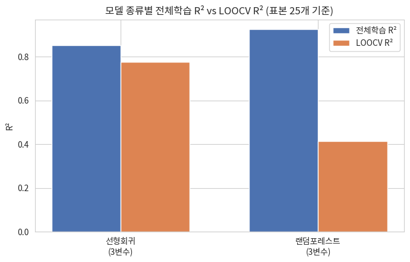

# 모델링결과보고서 — 서울시 카페 입지 분석

**작성자:** 김석호 | **프로젝트:** 엘리스 ABA 1차 프로젝트 (서울 버전) | **기준 데이터:** 서울시 상권분석서비스(자치구 단위 2026년 1분기)

---

## 1. 목적

**내가 서울에 카페를 개업하려 한다면, 어느 상권이 카페를 개업하기에 가장 적절할까?** 이 질문에 답하기 위해 "카페 1개당 평균매출"을 종속변수로 하는 회귀모델을 만들어 매출과 관련된 요인을 설명하고, 이를 근거로 최종 후보 입지를 선정한다. 서울시 데이터는 실제 매출액을 이미 제공하므로, 모델의 역할은 매출을 추정하기 위한 대리모델이 아니라 **"왜 특정 자치구의 매출이 더 높은가를 설명하는 모델"**이다. 그래서 평가지표도 정확도·RMSE가 아니라 설명력을 뜻하는 **R²**와, 처음 보는 자치구에도 그 설명력이 유지되는지를 보는 **LOOCV(Leave-One-Out Cross-Validation)**를 함께 본다. 이 프로젝트는 "카페 매출이 높다/낮다"를 나누는 분류 문제가 아니므로 정확도·정밀도·재현율·F1·ROC-AUC 같은 분류 지표는 애초에 해당하지 않는다.

## 2. 데이터 및 표본

- 분석 단위: 서울시 25개 자치구 (표본 수 n=25)
- 종속변수: 카페1개당_평균매출 = 당월_매출_금액 ÷ 전체_점포_수
- 후보 독립변수: 총_직장_인구_수, 총_상주인구_수, 총_가구_수, 총_유동인구_수, 집객시설_수, 지하철_역_수, 컨셉_적합도, 전체_점포_수, 운영_영업_개월_평균 (EDA 리포트 6장의 상관관계 참고)
- 표본이 25개뿐이라는 점은 모델링 전체에서 계속 고려하는 제약이다. 변수를 무한정 추가할 수 없고, 랜덤포레스트 같은 복잡한 모델은 과적합 위험이 특히 크다.

## 3. 기준선 모델

EDA에서 가장 강한 상관을 보인 log(총_직장_인구_수) 하나만 쓴 모델을 기준선으로 삼는다.

| 모델 | 전체학습 R² | LOOCV R² |
|---|---|---|
| 기준선 (log_직장인구 1개 변수) | **0.6748** | **0.6137** |

전체학습 R²와 LOOCV R²의 차이(0.061)가 크지 않아, 표본 25개 기준으로는 비교적 안정적인 모델이다.

## 4. 변수 선택 — 어떤 변수를 추가해야 하는가

직장인구 하나로 설명이 안 되는 부분을 다른 변수가 보충해줄 수 있는지, 후보 8개를 하나씩 추가해보고 LOOCV R²가 실제로 좋아지는지 확인했다(전체학습 R²만 보면 변수를 추가할수록 항상 좋아지는 것처럼 보이므로, LOOCV R² 기준으로 판단).

**1단계 — 두 번째 변수 추가**

| 추가한 변수 | 전체학습 R² | LOOCV R² |
|---|---|---|
| **총_가구_수** | 0.7668 | **0.6816** |
| 총_상주인구_수 | 0.7673 | 0.6770 |
| 운영_영업_개월_평균 | 0.7352 | 0.6206 |
| 전체_점포_수 | 0.6838 | 0.5938 |
| 컨셉_적합도 | 0.6810 | 0.5883 |
| 지하철_역_수 | 0.6764 | 0.5830 |
| 총_유동인구_수 | 0.6878 | 0.5725 |
| 집객시설_수 | 0.6750 | 0.5718 |

총_가구_수를 추가했을 때 LOOCV R²가 가장 크게 좋아진다(0.6137 → 0.6816). 총_상주인구_수도 비슷하지만 총_가구_수와 상관이 0.96으로 사실상 같은 정보라 하나만 쓰면 된다. log_직장인구와 총_가구_수의 상관은 -0.05로 거의 겹치지 않아, 다중공선성 걱정 없이 추가할 수 있다.

**2단계 — 세 번째 변수 추가** (log_직장인구 + 총_가구_수에 추가)

| 추가한 변수 | 전체학습 R² | LOOCV R² |
|---|---|---|
| **집객시설_수** | 0.8537 | **0.7778** |
| 총_유동인구_수 | 0.8134 | 0.7355 |
| 컨셉_적합도 | 0.7872 | 0.6823 |
| 지하철_역_수 | 0.7818 | 0.6619 |
| 전체_점포_수 | 0.8030 | 0.6609 |
| 운영_영업_개월_평균 | 0.7722 | 0.6579 |
| 총_상주인구_수 | 0.7689 | 0.6491 |

집객시설_수를 세 번째로 추가하면 LOOCV R²가 다시 한번 크게 좋아진다(0.6816 → 0.7778). 세 변수 사이 상관은 0.5 전후로 어느 정도 겹치지만(완전히 없다고는 못 함 — 9장 한계 참고), 표본 25개에서 변수 3개(표본 대 변수 비율 약 8:1)는 안정적으로 추정할 수 있는 한계에 가깝다.

**3단계 — 네 번째 변수를 추가하면?**

| 추가한 변수 | 전체학습 R² | LOOCV R² |
|---|---|---|
| 운영_영업_개월_평균 | 0.8580 | 0.7726 |
| 총_상주인구_수 | 0.8716 | 0.7720 |
| 총_유동인구_수 | 0.8558 | 0.7637 |
| 전체_점포_수 | 0.8565 | 0.7581 |
| 컨셉_적합도 | 0.8604 | 0.7564 |
| 지하철_역_수 | 0.8537 | 0.7422 |

4번째 변수는 무엇을 추가해도 LOOCV R²가 0.7778보다 높아지지 않는다 — 변수를 더 넣는 것은 표본 25개 기준으로 도움이 안 되고 과적합 위험만 키운다는 뜻이다. 그래서 **log_직장인구 + 총_가구_수 + 집객시설_수, 변수 3개짜리 모델을 최종 개선모델로 채택**한다.

## 5. 변수 선택 방식 점검 — 선택편향(다중비교) 위험 확인

후보를 여러 개 시도해보고 LOOCV가 가장 좋은 조합을 고르는 방식 자체에는 위험이 있다 — 후보를 충분히 많이 시도하면, 실제로는 매출과 무관해도 순전히 우연으로 LOOCV 점수가 좋게 나올 수 있다(통계학의 다중비교 문제·p-hacking과 같은 원리). 이 위험을 직접 확인하기 위해, 카페 매출과 전혀 관련 없는 순수 난수 변수를 최종 3변수 모델에 50번 추가해봤다.

- 아무 의미 없는 난수를 넣어도 50번 중 **12번**은 LOOCV가 더 좋아 보였다.
- 운이 가장 좋았던 경우는 LOOCV R²가 **0.8489**까지 나와, 실제로 채택한 집객시설_수(0.7778)보다도 높았다.

즉 LOOCV도 "후보를 무작정 많이 시도하면" 완전히 안전하지 않다. 이 위험은 다음과 같이 줄였다: ① 무작위 숫자가 아니라 매출과 관련 있을 법한 이유가 있는 변수 8개만 후보로 시도했다(수십~수백 개를 마구잡이로 시도하지 않음), ② 채택된 변수의 계수 부호가 실제로 설명 가능하다(7장), ③ 4번째 변수는 전부 LOOCV가 떨어지거나 비슷했다(하나도 개선되지 않음) — 계속 운 좋게 좋아지는 패턴이 아니라는 신호다. 다만 표본이 25개뿐인 이상 이 위험을 완전히 없앨 수는 없어 9장 한계에도 명시한다.

## 6. R²만으로는 감이 안 오는 부분 — MAE·RMSE로 실제 단위(원) 확인

R²는 "설명력 비율"이라 0.78이 실제로 얼마나 잘 맞춘다는 건지 감이 잘 오지 않는다. 그래서 "평균적으로 몇 만원 정도 틀리는지"를 보여주는 **MAE(평균절대오차)**와, 큰 오차에 더 민감한 **RMSE(평균제곱근오차)**를 보조 지표로 함께 확인했다.

| 모델 | 구분 | MAE(만원) | RMSE(만원) |
|---|---|---|---|
| 기준선 (log직장인구 1개) | 전체학습 | 410.2 | 539.3 |
| 기준선 (log직장인구 1개) | LOOCV | 445.7 | 587.7 |
| 개선모델 (3개 변수) | 전체학습 | 294.6 | 361.7 |
| 개선모델 (3개 변수) | LOOCV | **361.0** | **445.8** |

LOOCV 기준으로 보면 기준선 모델은 평균적으로 약 446만원(MAE), RMSE로는 약 588만원 정도 틀린다. 개선모델은 이 오차가 각각 361만원·446만원으로 줄어든다 — MAE 기준 약 19%, RMSE 기준 약 24% 오차가 줄어든 셈이라, R²가 0.61 → 0.78로 좋아진 것과 같은 방향으로 "실제로 더 잘 맞춘다"는 걸 원 단위로도 확인할 수 있다. 다만 이 수치가 "새 지역의 매출을 몇만원 오차로 예측할 수 있다"는 뜻은 아니다 — 이 모델의 목표는 예측이 아니라 설명이고, 표본이 25개뿐이라 오차 자체도 불안정할 수 있어 R²/LOOCV R²를 주 지표로 계속 사용한다.

## 7. 최종 채택 모델

```
카페1개당_평균매출 = 4,405,015.65 × log(총_직장_인구_수) − 103.29 × 총_가구_수 + 8,597.32 × 집객시설_수 − 28,043,343.16
```

- 전체학습 R² = 0.8537, **LOOCV R² = 0.7778**
- log_직장인구·집객시설_수는 계수가 양수, 총_가구_수는 음수 — 직장인구·집객시설이 많고 가구 수(주거지 성격)가 적은 자치구일수록 카페1개당 매출이 높다는 방향으로 해석된다. 종합하면 "주거지보다 업무·상업 기능이 강한 자치구"가 카페 매출이 높다는 그림이다.



## 8. 잔차 분석 — 3변수 모델로도 설명 안 되는 자치구

잔차 = 실제 카페1개당_평균매출 − 모델 예측값.

**예상보다 매출이 높은 자치구 Top5**

| 자치구 | 잔차 |
|---|---|
| 관악구 | +663만원 |
| 중구 | +631만원 |
| 동작구 | +467만원 |
| 광진구 | +418만원 |
| 종로구 | +408만원 |

**예상보다 매출이 낮은 자치구 Top5**

| 자치구 | 잔차 |
|---|---|
| 용산구 | -750만원 |
| 구로구 | -664만원 |
| 동대문구 | -451만원 |
| 은평구 | -337만원 |
| 강서구 | -320만원 |

관악구·중구·동작구는 직장인구·가구수·집객시설만으로 예측한 것보다 실제 매출이 더 높다 — 모델에 안 들어간 다른 요인(대학가·관광지 유동인구 등)이 있을 가능성을 시사하며, 최종 인사이트 리포트에서 이 지역들을 행정동 단위로 더 들여다본다.

## 9. 다른 모델은 왜 안 쓰는가 — 랜덤포레스트와 직접 비교

같은 변수 3개, 같은 LOOCV 방식으로 랜덤포레스트를 학습시켜 선형회귀와 비교했다.

| 모델 | 전체학습 R² | LOOCV R² | 과적합 정도(전체−LOOCV) |
|---|---|---|---|
| 선형회귀 (3변수) | 0.8537 | 0.7778 | 0.0759 |
| 랜덤포레스트 (3변수, 동일) | 0.9253 | 0.4141 | 0.5112 |

랜덤포레스트는 전체학습 R²가 0.93으로 선형회귀(0.85)보다 높지만, 이는 학습 데이터 25개를 "더 잘 외웠다"는 뜻일 뿐이다. LOOCV R²는 오히려 0.41로 뚝 떨어져, 선형회귀(0.78)에 크게 못 미친다. 표본이 25개뿐일 때 복잡한 모델을 쓰면 안 되는 이유를 실제로 보여주는 결과다. 랜덤포레스트는 계수로 결과를 설명할 수도 없어 이 프로젝트의 목표(설명 가능한 모델)와도 맞지 않는다. 그래서 이 프로젝트에서는 표본 크기에 맞고 해석도 가능한 선형회귀를 최종적으로 채택한다.

## 10. 한계 및 유의사항

- **표본 크기**: 자치구 단위 회귀는 n=25로 매우 작다. 변수를 3개까지만 채택하고 LOOCV로 검증한 것 모두 이 제약을 고려한 선택이다.
- **선택편향 위험**: 5장에서 확인했듯, 여러 변수를 시도해 LOOCV가 좋은 조합을 고르는 방식은 표본 25개에서 순수 우연으로 점수가 좋아 보일 위험이 있다. 관련성 있는 변수로만 후보를 제한하고 계수 해석 가능성으로 재확인했지만, 위험을 완전히 배제할 수는 없다.
- **다중공선성**: log_직장인구·총_가구_수·집객시설_수 세 변수 사이에 상관 0.5 전후가 일부 남아 있어, 계수 크기를 "순수한 영향력"으로 과신하지 않고 방향성(양/음) 위주로 해석한다.
- **인과관계 아님**: 이 모델은 상관·설명 모델이며, "직장인구가 늘면 매출이 는다"는 인과를 증명하지 않는다. 역의 인과(매출 높은 곳에 직장이 몰림)나 공통 원인(상권 성숙도·지가 등)의 가능성이 있다 — 최종 인사이트 리포트에서 더 다룬다.
- **데이터 시점 불일치**: 자치구 단위는 2026년 1분기까지, 행정동 단위는 2025년 4분기까지만 제공돼 두 레벨의 분석 시점이 한 분기 어긋나 있다.
- **MAE·RMSE는 보조 지표**: 6장의 오차 수치는 R²/LOOCV R²가 실제로 얼마나 쓸모 있는 수준인지 감을 더해주는 참고용이며, 예측 정확도를 보장하는 지표로 쓰지는 않는다.
